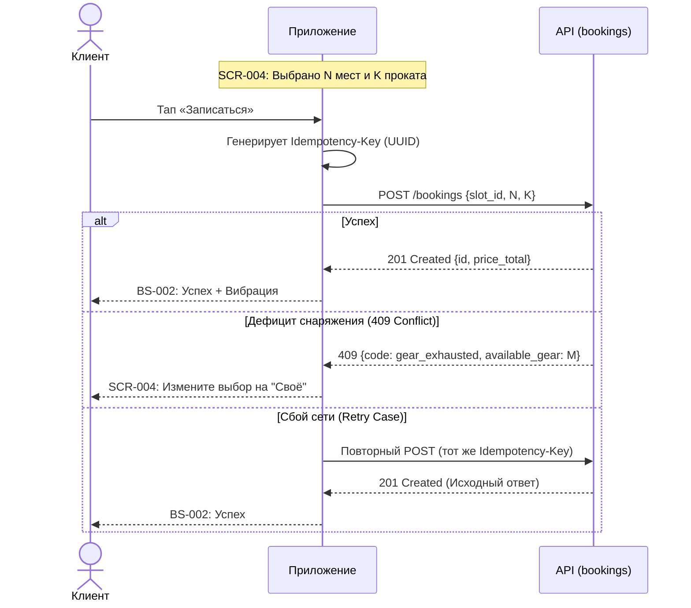

# Sequence-диаграммы API

## 1. Создание брони (createBooking)



## 2. Отмена брони (cancelBooking)

```mermaid
sequenceDiagram
    actor User as Клиент
    participant App as Приложение
    participant API as API (bookings)

    User->>App: Тап «Отменить» (SCR-006)
    App-->>User: BS-003: Подтверждение
    User->>App: Подтверждает отмену
    
    App->>App: Генерирует Idempotency-Key (UUID)

    App->>API: POST /bookings/{id}/cancel
    Note over API: Re-validation: проверка времени (start_at - 2h)

    alt Ранняя отмена (>= 2ч)
        API-->>App: 200 OK {status: cancelled}
        App-->>User: SCR-006: Снек «Отменено» + Вибрация
    else Поздняя отмена (< 2ч)
        API-->>App: 200 OK {status: late_cancel}
        App-->>User: SCR-006: Снек «Место не освобождено» + Вибрация
    else Ошибка: Занятие началось
        API-->>App: 422 Unprocessable {code: slot_started}
        App-->>User: SCR-006: Снек «Отмена невозможна»
    end
