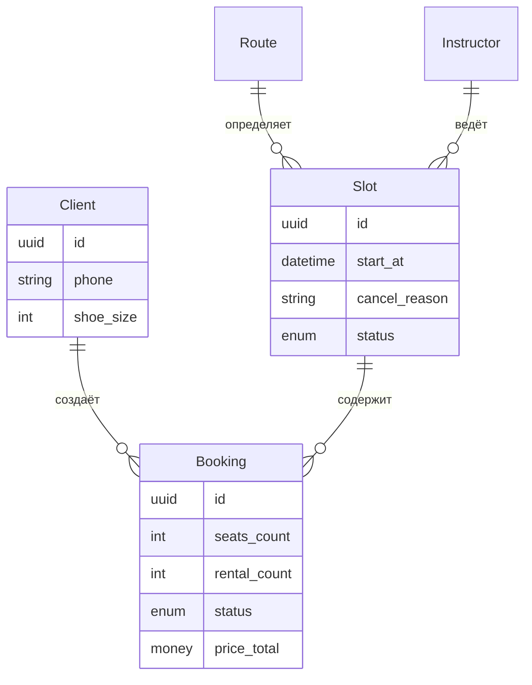

# Модель данных

> Этап 3. Проектирование. Описание сущностей, атрибутов и инвариантов.
> Обновлено: Добавлены поля для системной отмены и уточнены форматы геоданных.

## 1. Сущности и атрибуты

### Client (Клиент)
| Атрибут | Тип | Описание |
| :-- | :-- | :-- |
| **id** | UUID (PK) | Уникальный идентификатор. |
| **name** | string | Имя атлета. |
| **phone** | string | Номер телефона (Unique Login). |
| **shoe_size** | int | Размер обуви (30–50) для подготовки проката. |

### Route / Format (Формат тренировки)
| Атрибут | Тип | Описание |
| :-- | :-- | :-- |
| **id** | UUID (PK) | Идентификатор формата. |
| **name** | string | «Болдеринг» или «Высокая стена». |
| **capacity_cap**| int | Потолок вместимости (8 или 16). |
| **geometry** | string | **Технический формат:** Encoded Polyline или GeoJSON строка для отрисовки сектора в Yandex Maps SDK. |

### Instructor (Инструктор)
| Атрибут | Тип | Описание |
| :-- | :-- | :-- |
| **id** | UUID (PK) | Идентификатор тренера. |
| **name** | string | Имя и фамилия. |
| **is_top** | bool | Флаг «Звездный тренер» (⭐). |

### Slot (Конкретная тренировка)
| Атрибут | Тип | Описание |
| :-- | :-- | :-- |
| **id** | UUID (PK) | Идентификатор слота. |
| **start_at** | datetime | Время старта (UTC). |
| **free_seats** | int | Свободно мест (динамическое). |
| **free_gear** | int | Свободно снаряжения (динамическое). |
| **status** | enum | `scheduled` / `cancelled`. |
| **cancel_reason**| string | Причина отмены (напр. «Профилактика»). Наследуется в Booking. |

### Booking (Бронь)
| Атрибут | Тип | Описание |
| :-- | :-- | :-- |
| **id** | UUID (PK) | Идентификатор брони. |
| **seats_count** | int | Общее кол-во мест (1-3). |
| **rental_count**| int | Из них с прокатом (0..seats_count). |
| **status** | enum | `active`, `cancelled`, `late_cancel`, `club_cancelled`. |
| **price_total** | money | Итог (Source of Truth — Server). |

---

## 2. ERD (Диаграмма связей)

## 3. Ключевые инварианты (Логика целостности)

### 3.1 Расчёт свободных мест
Система вычисляет доступность мест в группе по формуле:
`Slot.free_seats = Slot.total_seats — Σ(Booking.seats_count WHERE status IN [active, late_cancel])`

### 3.2 Расчёт свободного снаряжения
Система вычисляет остаток прокатного инвентаря по формуле:
`Slot.free_gear = 12 — Σ(Booking.rental_count WHERE status IN [active, late_cancel])`

> **Важное примечание:** Поздняя отмена (`late_cancel`) — это отмена менее чем за 2 часа до старта. В этом случае ресурсы (место в зале и снаряжение) **не возвращаются** в фонд доступных для других пользователей до момента фактического завершения времени тренировки.

### 3.3 Приоритет отмены (Club Override)
Если статус тренировки (**Slot.status**) переводится администратором в состояние `cancelled` (например, при профилактике), срабатывает каскадное обновление:
1. Все связанные записи (**Booking.status**) автоматически получают статус `club_cancelled`.
2. Текст причины отмены транслируется из поля **Slot.cancel_reason** в уведомления пользователям.
3. Все забронированные ресурсы (места и снаряжение) мгновенно возвращаются в общий фонд.
