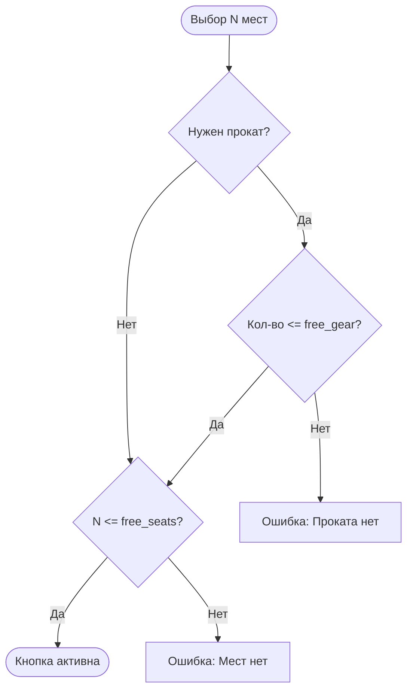

# {Название логики}

**ID:** LOGIC-XXX  
**Тип:** Логика  
**Домен:** 09. Логики  
**Приоритет:** {Critical | High | Medium | Low}  
**Статус:** {Черновик | Актуален}  
**Функциональные блоки:** {FB-BOOKING-001, FB-AUTH-002, ...}

---

## История изменений

| Релиз | ТЗ | Описание изменений |
|-------|-----|-------------------|
| 1.0.0 | [SCR-XXX] | Первоначальная документация логики |

---

## Входные данные

> *Указывать, если логика зависит от кэша, состояния или данных из профиля.*

| Название | Тип | Источник | Описание |
|----------|-----|----------|----------|
| `shoeSize` | integer | Кэш / Профиль | Размер обуви атлета для предзаполнения проката. |
| `freeGear` | integer | API / Slot | Доступное количество комплектов снаряжения (12 шт). |

---

## Обзор

{Краткое описание: что делает логика. Например: "Логика проверяет доступность мест в группе и наличие свободного снаряжения параллельно".}

### User Story

> Как Клиент, я хочу, чтобы система проверяла наличие тапок отдельно от мест в зале,
> чтобы я мог записаться со своим снаряжением, даже если прокат пуст.

### Бизнес-ценность

- Исключение конфликтов на ресепшене при выдаче снаряжения.
- Повышение выручки за счет разделения лимитов «Человек» и «Инвентарь».

---

## Точки применения

| Экран/Компонент | Триггер | Условие |
|-----------------|---------|---------|
| [SCR-004 Бронирование] | При открытии / Изменение степпера | Всегда |

---

## Флоу (Диаграмма процесса)

## Описание логики
Шаг 1: {Название, напр: Проверка лимита группы}
{Детальное описание. Например: "Система запрашивает лимит формата (8 для болдеринга) и вычитает текущее количество записей..."}
Шаг 2: {Название, напр: Резервирование инвентаря}
{Описание. Например: "Если флаг needs_rental = true, система блокирует 1 единицу из общего фонда в 12 комплектов..."}
## API запросы (Транзакции)
{METHOD} {endpoint}
Триггер: {Напр: Нажатие кнопки "Записаться"}
Headers:
Idempotency-Key: UUID (обязателен для защиты от дублей)
Параметры/Body:
| Параметр | Тип | Описание | Значение |
|----------|-----|----------|----------|
| participants | array | Список гостей | [{needs_rental: true}, ...] |
## Локальное хранение
Ключ	Тип хранения	Описание
last_rental_choice	Local Storage	Запоминает, брал ли пользователь прокат в прошлый раз.
## Связанные требования
ID	Название	Приоритет
FR-13	Валидация бронирования	Critical
R-001	Раздельные лимиты	Must
## Критерии приёмки
ID	Критерий
AC-001	Дано мест в зале 2, снаряжения 0. Когда атлет выбирает "Своё снаряжение", Тогда кнопка записи активна.
AC-002	Дано атлет выбирает "Прокат", Тогда система блокирует выбор, если свободного снаряжения < 1.
## Обработка ошибок
Тип ошибки	Контекст	Действие
GEAR_EXHAUSTED	Ответ API 409	Переключить опцию на "Своё" и показать снек-подсказку.
