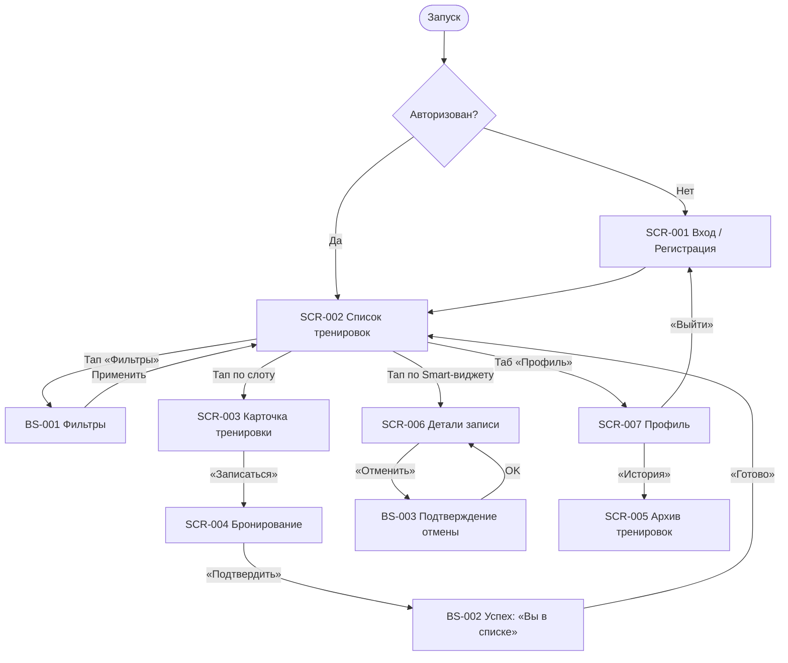

# Фича-лист мобильного приложения «Вертикаль»

> **Этап 5.** Перечень экранов клиентского приложения и доступных на них функций. Связующий артефакт между аналитикой и техническим заданием (ТЗ).

**Статус:** Актуален · **Версия:** 1.0 · **Дата:** 2026-07-06

---

## 1. Назначение

**«Вертикаль»** — мобильное приложение для самостоятельной записи клиентов на групповые тренировки по скалолазанию. Заменяет ручную запись через Telegram, устраняя овербукинг и путаницу со снаряжением.

**Скоуп приложения — только роль «Клиент».** Персонал (инструкторы и владелец Оля) работают через существующую админку. Приложение потребляет данные из API в режиме **read-only**; оплата — **офлайн** (в зале).

**Источники:**
[Бриф](../0-customer-brief/customer-brief.md) · [Бизнес-требования](../2-requirements/business-requirements.md) · [ФТ](../2-requirements/functional-requirements.md) · [НФТ](../2-requirements/non-functional-requirements.md) · [Use cases](../2-requirements/use-cases.md) · [User stories](../2-requirements/user-stories.md) · [Модель данных](../4-design/data-model.md)

---

## 2. Глоссарий и роли

| Термин | Значение |
|--------|----------|
| **Тренировка / Слот** | Занятие в расписании: время, формат, тренер, цена, остаток мест и снаряжения. |
| **Формат** | Болдеринг (лимит 8 мест) или Высокая стена (лимит 16 мест). |
| **Снаряжение** | Прокатный фонд (скальники + страховка). Всего 12 комплектов на весь клуб. |
| **Бронь** | Запись клиента (1–3 места) с выбором типа снаряжения для каждого участника. |
| **Ранняя отмена** | Отмена за ≥ 2 часа до старта. Места и снаряжение возвращаются в фонд. |
| **Поздняя отмена** | Отмена за < 2 часа до старта. Ресурсы не возвращаются (простой), штрафов в MVP нет. |

> **Логика раздельных лимитов (R-001):**
> Доступность тренировки для записи определяется двумя независимыми условиями:
> 1. **Места:** `N_мест ≤ (Вместимость_формата - Занято_мест)`.
> 2. **Снаряжение:** Если выбран прокат, `K_комплектов ≤ (12 - Выдано_комплектов)`.
> *Своё снаряжение не расходует фонд в 12 единиц, что позволяет бронировать места профи-атлетам даже при пустом прокате.*

---

## 3. Карта навигации

## 4. Инвентарь экранов
ID	Экран	Тип	Назначение	Приоритет
SCR-001	Регистрация / Вход	Экран	Вход по телефону без пароля (OTP).	Critical
SCR-002	Список тренировок	Экран	Главная: расписание + Smart-виджет брони.	Critical
BS-001	Фильтры	Шторка	Сужение списка по дате, формату, тренеру.	High
SCR-003	Карточка тренировки	Экран	Полные детали слота и карта сектора.	Critical
SCR-004	Бронирование	Экран	Выбор мест (1-3), проката и ТБ.	Critical
BS-002	Успех («Вы в списке»)	Экран	Полноэкранный успех + запрос Push.	High
SCR-005	Архив тренировок	Экран	История посещений и отмен (вход из Профиля).	Medium
SCR-006	Детали записи	Экран	Просмотр активной брони и дедлайна отмены.	Critical
BS-003	Подтверждение отмены	Шторка	Логика ранней/поздней отмены.	High
BS-004	Карта зала	Шторка	Интерактивная карта Яндекс с пином входа.	Medium
SCR-007	Профиль	Экран	ФИО, телефон, размер обуви, выход/удаление.	Medium
## 5. Детализация по ключевым функциям
SCR-002 · Главный экран и Smart-виджет
Smart-виджет: Приоритетная карточка текущей записи. В случае отмены скалодромом (R-008) становится красной и показывает причину.
Индикация проката: В общем списке отображается статус «👟 Проката нет», если инвентарь клуба исчерпан.
Offline Mode: Баннер «Нет сети». Виджет доступен из кэша (US-14).
SCR-004 · Оформление записи
Групповая бронь: Степпер (1–3 чел). Имена гостей не собираются.
Индивидуальный выбор: Для каждого участника переключатель «Своё / Прокат».
Smart-валидация: Если тапки кончились, система принудительно ставит «Своё» и блокирует «Прокат».
Безопасность (FR-10.1): Обязательное подтверждение Техники Безопасности при первой записи.
SCR-006 · Детали брони и Отмена
Динамический дедлайн: Расчёт start_at - 2 часа. Текст меняется с «Бесплатно» на «Место закреплено».
Re-validation: Перепроверка серверного времени в момент клика на «Отменить».
## 6. Сквозные механизмы (Technical)
Push-уведомления (Must): Напоминания за 24 и 2 часа (FR-33).
Идемпотентность (NFR-24): Обязательный Idempotency-Key для защиты от дублей брони при плохой связи.
Haptic: Виброотклик при успехе бронирования и отмены.
Accessibility: Контраст по WCAG AA. Крупные тач-зоны 48pt (учет магнезии).
## 7. Не входит в MVP (Phase 2+)
Онлайн-оплата (эквайринг).
Рейтинги и текстовые отзывы об инструкторах.
Лист ожидания (Waitlist).
Программа лояльности (скидки/бейдж).
